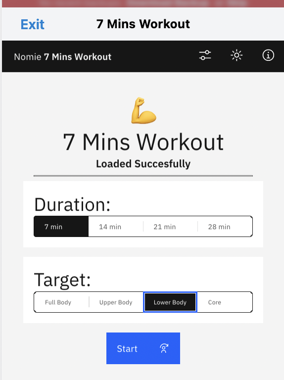
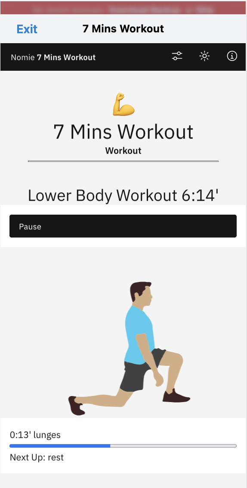
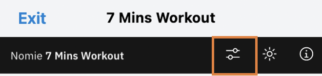
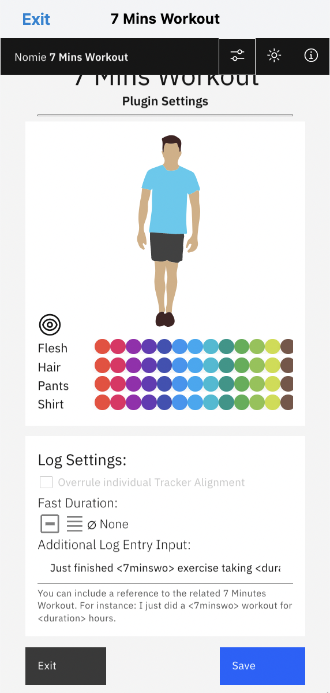

# 💪Nomie 7 Minutes Workout Plugin

The 💪Nomie 7 Minutes Workout Plugin is a plugin for Nomie6-oss.

## About the 💪Nomie 7 Minutes Workout Plugin

The Nomie 7 Minutes Workout Plugin is a very simple bodyweight workout plugin based on Brett Klika's book "7 Minutes to Fit: 50 Anytime, Anywhere Interval Workouts." Choose the timeframe, select the target area, and do a bodyweight workout practically anywhere.

When your workout is completed the plugin can autmatically log your results to the Nomie Trackable of your choice.

## Installing the Plugin

The url of the plugin is:

[https://dailynomie.github.io/nomie-plugin-7minwo/](https://dailynomie.github.io/nomie-plugin-7minwo/)

The ⏲Nomie 7 Minutes Workout Plugin can be installed in Nomie via the following steps:

* Go to the More Tab
* Select Plugins
* Click the + or Add Custom Plugin
* Provide the url for the plugin
* Tap Install Plugin

## Using the Plugin

After launching the plugin, you will be presented with the main screen. This screen gives you the option to choose the duration of your workout and the type of workouts you would like to do:

After making your choice, please click the start button to start your workout and just follow the instructions on the screen:

After your workout is finished, your results will automatically be logged to Nomie when you have enabled that settings in the Settings area.

## The Plugin Settings

You have the ability to change some of the default settings of this plugin. You can go to the settings area by clicking on the 'settings' button at the top of the screen:

You will then enter the following screen:

As you can see in above picture, you can change the colors of the animated person, set the Trackable to which the duration of the workout should be logged and include a default sentence in the log to Nomie which can include the parameters '7minswo' for the workout type and 'duration' for the duration of the workout. Just place these keywords between <>.

I guess there is nothing more to add for this plugin.

As always.....just enjoy and have fun with it!
